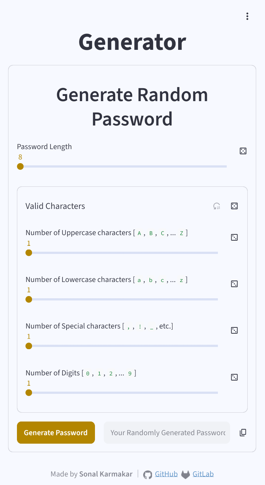
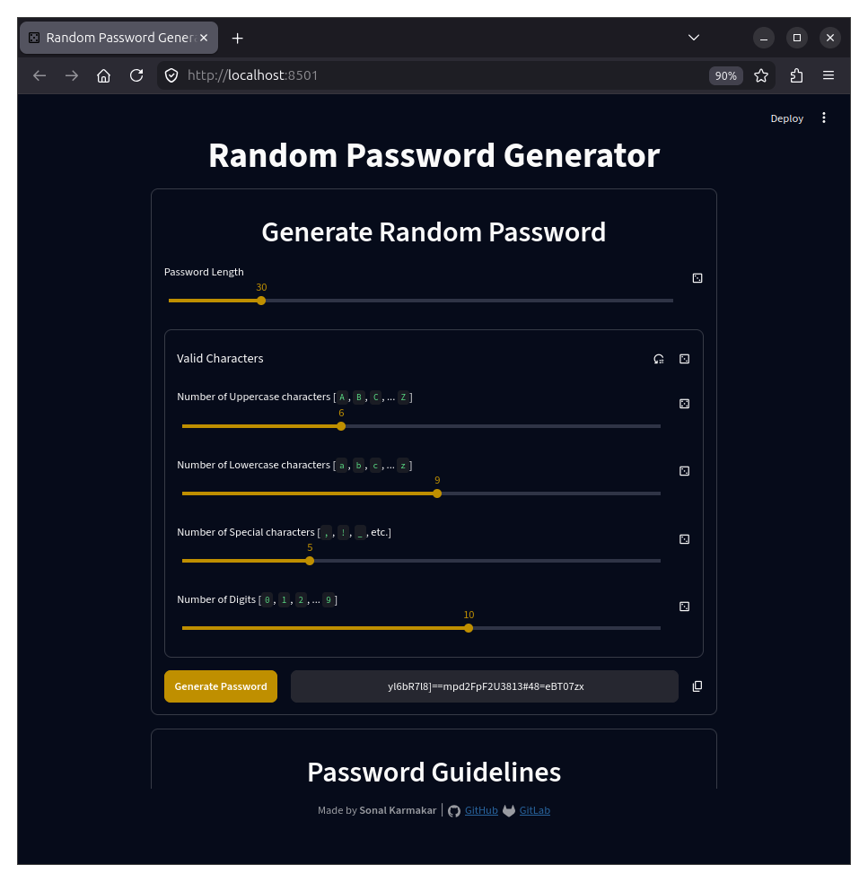

# Random Password Generator with Streamlit
## Summary
This is a web-application that generates a random password based on the user-input of how many uppercase, lowercase, special characters and digits must be present in the password.

This version of the application is written in Python with the [Streamlit library](https://streamlit.io/).

## Screenshots
| UI Library | Mobile UI                                                     | Desktop UI                                                      |
|:----------:|:-------------------------------------------------------------:|:---------------------------------------------------------------:|
| Streamlit  |  |  |

## Environment Setup
Follow the steps below to set up your environment for running and developing this application:
- <ins>**Step 1:**</ins> Install Python.
	- 🪟 Windows:
		> ℹ️ Remember to add the Python binary to your path from the installers.
		- _Option 1:_ Download and run the [official installer](https://www.python.org/downloads/windows/) from _Python.org_.
		- _Option 2:_ Install from [Microsoft Store](https://apps.microsoft.com/search/publisher?name=Python%20Software%20Foundation).
		- _Option 3:_ Install using [Windows Package Manager (`winget`)](https://learn.microsoft.com/en-us/windows/package-manager/winget/).
			```powershell
			winget install Python.Python.3
			```
	- 🍎 macOS:
		- _Option 1:_ Download and run the [official installer](https://www.python.org/downloads/macos/) from _Python.org_.
		- _Option 2:_ Install using [Homebrew (`brew`)](https://brew.sh/).
			```sh
			brew install python
			brew upgrade python
			```
	- 🐧 Linux:
		- _Option 1:_ Follow the official [Python documentation](https://docs.python.org/3/using/unix.html).
		- _Option 2:_ Check your distribution's documentation and repositories.

> [!IMPORTANT]
> - Depending on your OS, the Python binary can be named either "`python`" or "`python3`". The binary will be referred to as "`python`" here for convenience, you can replace it with "`python3`" in the commands if necessary.
> - You may need to install additional package(s) for _virtual environments_. For example, the package "`python3.xx-venv`" is required for virtual environments in Ubuntu.

- <ins>**Step 2:**</ins> Upgrade Python's built-in package manager `pip`.
	```sh
	python -m pip install --upgrade pip
	```

> [!NOTE]
> Your system may not automatically install the `pip` module. In that case, you need to _perform Step 2 after Step 4_.

- <ins>**Step 3:**</ins> Download or clone this project's repository.
	- _Option 1:_ Download the project files using the Download Button from the web interface.
	- _Option 2:_ Clone this repository if you have [installed](https://git-scm.com/install/) and [configured](https://git-scm.com/book/en/v2/Getting-Started-First-Time-Git-Setup) _Git_.
		```sh
		git clone https://github.com/sonalkarmakar/Random-Password-Generator.git
		```
		Or,
		```sh
		git clone https://gitlab.com/sonalkarmakar/Random-Password-Generator.git
		```
	- Go inside the project directory and open the Terminal/Console/Command Prompt/PowerShell.

> [!IMPORTANT]
> If you cloned this repository, you need to switch to the `streamlit` branch in the project directory:
> ```sh
> git switch streamlit
> ```

- <ins>**Step 4:**</ins> Create a virtual environment. Ensure that you're inside the project directory, and then run the commands below.
	- Creating a virtual environment:
		```sh
		python -m venv .venv # replace ".venv" with your preferred name
		```
	- Activating the virtual environment:
		- 🪟 Windows
			- From Command Prompt
				```cmd
				.venv\Scripts\activate.bat
				```
			- From PowerShell
				```powershell
				.venv\Scripts\Activate.ps1
				```
		- 🐧 Linux and 🍎 macOS
			```sh
			source .venv/bin/activate
			```
			> ℹ️ Use `activate.fish` for _Fish shell_ and `activate.csh` for _C shell_.
	- Exiting the virtual environment (all OS):
		```sh
		deactivate
		```
	> ✒️ You can _upgrade the `pip` module inside the virtual environment_ now, if your Python 3 installation didn't come with it.

- <ins>**Step 5:**</ins> Install the required packages from the index. Ensure that you're in the _virtual environment_ inside the project directory.
	```sh
	python -m pip install -r requirements/streamlit-requirements.txt
	```

## Running and Packaging/Deployment
- To run the application, simply activate the virtual environment, and then run the command below.
	```sh
	python streamlit_main.py
	```
- Refer to [Streamlit documentation](https://docs.streamlit.io/deploy) for packaging and deployment configurations.

## References
- [Streamlit documentation](https://docs.streamlit.io/deploy).